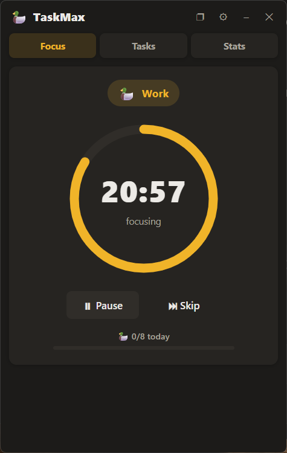
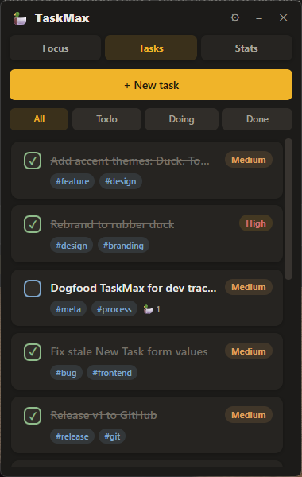
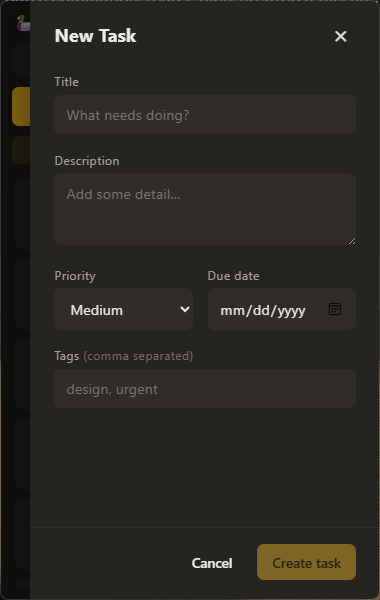
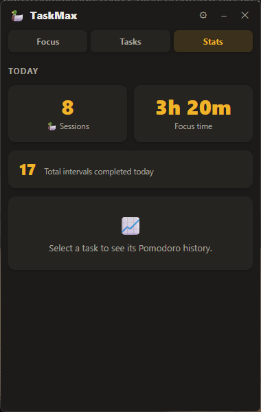
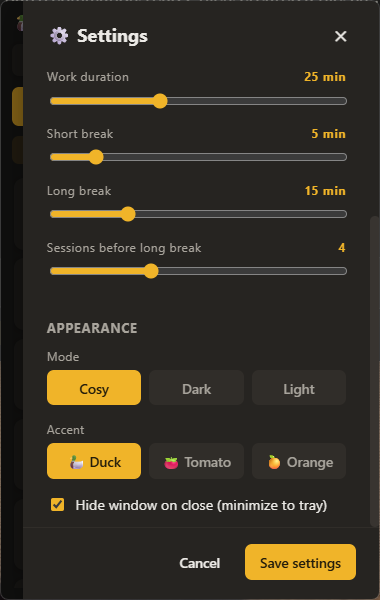
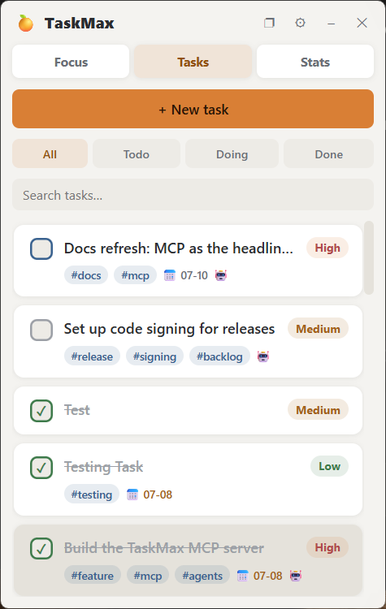
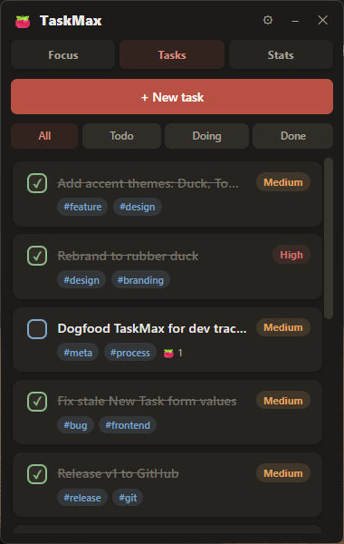

# 🦆 TaskMax

A cute, compact **desk widget for tasks and Pomodoro focus sessions**, built with Go + Wails + Svelte. It docks to the corner of your screen, stays on top while you work, and lives in your system tray when you close it. Fully offline on a local SQLite database out of the box — or point it at PostgreSQL/MySQL if you prefer.

> Why a duck? Every software engineer needs a [rubber duck](https://en.wikipedia.org/wiki/Rubber_duck_debugging) on their desk. The Pomodoro technique's tomato lives on as an optional accent theme.

<p align="center">
  
</p>

---

## ✨ What it does

### Focus timer

A classic Pomodoro cycle: 25-minute work sessions, short breaks, and a long break every 4 sessions (all adjustable). The countdown runs in Go, so it keeps ticking even when the UI is hidden. When a session ends you get a desktop notification and the app rolls into the next session automatically. Completed sessions are counted against the task you were focusing on.

### Task management

| Tasks | New task | Stats |
|:--:|:--:|:--:|
|  |  |  |

- Tasks carry a **title, description, priority, due date, and tags**.
- Click a task's checkbox to cycle its status: **todo → in progress → done**. Filter the list by status with the All / Todo / Doing / Done tabs.
- **Drag to reorder** the list; the order is saved.
- Select a task and hit **Focus** to attach the timer to it — every completed work session adds a 🦆 to that task.
- **Stats** shows today's completed sessions and total focus time, plus a per-task session history.

### A widget, not a window

TaskMax is calculator-sized (380×600), frameless, and always on top. It docks itself to the bottom-right corner on startup, and you can drag it anywhere by its titlebar. Closing it (✕) hides it to the **system tray** — left-click the duck in the tray to bring it back, right-click for Show / Quit. (Set `minimize_to_tray: false` if you'd rather ✕ quit outright.)

### Make it yours

| Settings | Light mode | Tomato accent |
|:--:|:--:|:--:|
|  |  |  |

Appearance is two independent choices in **⚙ Settings**:

- **Mode** — `cosy` (warm dark), `dark` (neutral black), or `light` (clean paper).
- **Accent** — `duck` 🦆, `tomato` 🍅, or `orange` 🍊. The accent sets the brand colour *and* the mascot used across the app.

---

## 🚀 Run it locally

### Prerequisites

- **Go** 1.22+
- **Node.js** 18+ and npm
- **Wails CLI** v2 — `go install github.com/wailsapp/wails/v2/cmd/wails@latest`
- Platform webview:
  - **Windows** — WebView2 (preinstalled on Windows 10/11). No C compiler needed — the SQLite driver is pure Go.
  - **macOS** — WebKit (built in)
  - **Linux / WSL** — `libgtk-3-dev` and `libwebkit2gtk-4.0-dev` (see Linux notes)

### Build and run

```bash
git clone https://github.com/lmbangel/TaskMax.git
cd TaskMax

make setup     # install the Wails CLI, Go modules, and npm packages
make dev       # run with hot-reload (best for development)

# or build a real binary:
make build     # → ./build/bin/TaskMax.exe (Windows) / TaskMax (Linux/macOS)
make run       # build, then launch
```

No `make`? The direct equivalents are `wails dev` and `wails build` from the repo root (run `npm install` inside `frontend/` first).

### Linux / WSL notes

The Wails webview needs GTK + WebKit — install once with `make system-deps`. Distros shipping **webkit2gtk 4.0** (e.g. Ubuntu 22.04) need a build tag, which the Makefile adds automatically on Linux; for **webkit2gtk 4.1** use `make build WAILS_TAGS=webkit2_41`. On WSL, clone into the WSL filesystem (not `/mnt/c/...`) for a faster dev loop; the window is provided by WSLg on Windows 11.

### Download & install

Grab the latest build from the [**Releases page**](https://github.com/lmbangel/TaskMax/releases):

- **Windows** — `TaskMax-windows-amd64-installer.exe` (installer) or `...-portable.exe` (no install, just run)
- **macOS** — `TaskMax-macos-universal.zip` (Intel + Apple Silicon)
- **Linux** — `TaskMax-linux-amd64.tar.gz`

> The binaries are unsigned, so Windows SmartScreen / macOS Gatekeeper will warn on first launch — choose "More info → Run anyway" (Windows) or right-click → Open (macOS).

Releases are built automatically by GitHub Actions whenever a version tag is pushed (`git tag v0.2.0 && git push origin v0.2.0`).

---

## ⚙️ Configuration

Settings live in `config.yaml`, created automatically on first run. Where it (and the SQLite database) lives depends on how you run TaskMax:

- **Installed** — `%AppData%\TaskMax` on Windows (`~/.config/TaskMax` on Linux, `~/Library/Application Support/TaskMax` on macOS). Program Files stays read-only, as it should.
- **Portable / dev checkout** — if a `config.yaml` already exists in the working directory or next to the executable, TaskMax uses that directory instead. Data travels with the binary.

Everything here is also editable from the in-app **⚙ Settings** panel, which rewrites this file when you save.

```yaml
app:
    accent: duck            # duck | tomato | orange
    minimize_to_tray: true  # ✕ hides to the tray instead of quitting
    theme: cosy             # cosy | dark | light
database:
    dsn: tasks.db           # file path for sqlite, connection string for others
    type: sqlite            # sqlite | postgres | mysql
pomodoro:
    long_break: 15          # minutes
    sessions_before_long: 4
    short_break: 5
    work_duration: 25
```

## 🗄️ Database

TaskMax stores tasks and Pomodoro session history in **SQLite by default** (`tasks.db`, created on first run) — zero setup, fully offline, and no C toolchain required (the driver is pure Go). Tables are auto-migrated on startup.

To use an external database instead, switch `database.type` and provide a DSN:

- **PostgreSQL**
  ```yaml
  database:
    type: postgres
    dsn: "host=localhost user=taskmax password=secret dbname=taskmax port=5432 sslmode=disable"
  ```
- **MySQL**
  ```yaml
  database:
    type: mysql
    dsn: "taskmax:secret@tcp(127.0.0.1:3306)/taskmax?charset=utf8mb4&parseTime=True&loc=Local"
  ```

Use the **Test connection** button in Settings to validate a DSN before saving. Changing the database driver takes effect after an app restart.

---

## 🗺️ Roadmap

- [x] **Downloadable installer** — Windows installer + macOS/Linux builds, published automatically as GitHub Releases on every version tag
- [ ] Code-signing the release binaries (currently unsigned → SmartScreen/Gatekeeper warnings)
- [x] Single-instance guard — launching the app again just brings the existing widget back
- [ ] Remember the window position between restarts
- [ ] Tray icon that matches the chosen accent
- [ ] Auto-set a task to "in progress" when you start focusing on it

---

## 📄 License

MIT — see [LICENSE](LICENSE).
